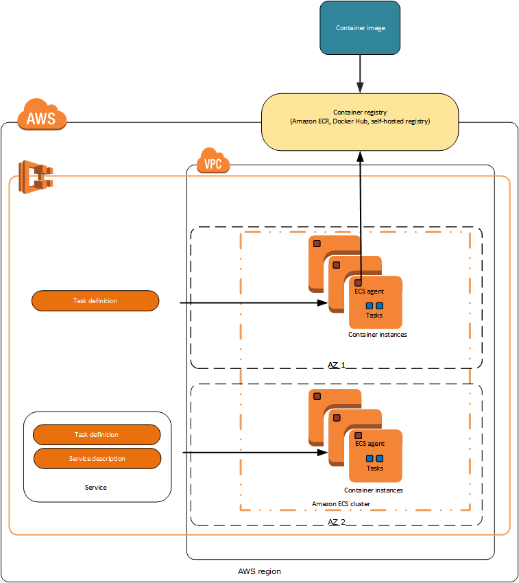

# TERRAFORM ECS-EFS

---

The purpose is to build a simple Fargate backed ECS Cluster + Service + Task & EFS persistent volume with Terraform. The terraform state file is stored on S3 as the backend.

---

### Features

- Build ECS Cluster on Fargate
- Create EFS persistent volume mounts
- Create Service & Task Definition
- Create logging system

---



#### Pre-requisite

- Make sure you have installed [Terraform](https://learn.hashicorp.com/tutorials/terraform/install-cli), [AWS CLI](https://docs.aws.amazon.com/cli/latest/userguide/install-cliv2-mac.html#cliv2-mac-prereq), and configured a `default` AWS CLI profile (see doc [here](https://docs.aws.amazon.com/cli/latest/userguide/cli-configure-quickstart.html#cli-configure-quickstart-profiles))

```bash
terraform -help # prints Terraform options
which aws # prints /usr/local/bin/aws
aws --version # prints aws-cli/2.0.36 Python/3.7.4 Darwin/18.7.0 botocore/2.0.0
aws configure # configure your AWS CLI profile
```

#### Configuration

- Create an [S3 bucket](https://www.terraform.io/docs/language/settings/backends/s3.html) to store Terraform state. Populate bucket name in `tfstate.tf`

* Populate `terraform.tfvars`:

```bash
cloudwatch_group = "btcmonitoring"
service_name  = "btc-service"
service_count = 1
cluster_name = "btc-on-ecs"
```

* Create the task execution IAM role using the AWS CLI:
- Create a file named task-execution-assume-role.json with the following contents:

```bash
{
  "Version": "2012-10-17",
  "Statement": [
    {
      "Sid": "",
      "Effect": "Allow",
      "Principal": {
        "Service": "ecs-tasks.amazonaws.com"
      },
      "Action": "sts:AssumeRole"
    }
  ]
}
```
- Create the task execution role:
`aws iam --region us-west-2 create-role --role-name ecsTaskExecutionRole --assume-role-policy-document file://task-execution-assume-role.json`

- Attach the task execution role policy:

`aws iam --region us-west-2 attach-role-policy --role-name ecsTaskExecutionRole --policy-arn arn:aws:iam::aws:policy/service-role/AmazonECSTaskExecutionRolePolicy`


---

### Usage

```bash
terraform plan -out plan -var-file=terraform.tfvars
terraform apply plan
```

---

<p align='center'>

  <a href="https://www.linkedin.com/in/prasanjit-singh/">
    
  </a>&nbsp;&nbsp;
  <a href="https://youtube.com/binpipe">
            
  </a>&nbsp;&nbsp;

</p>
